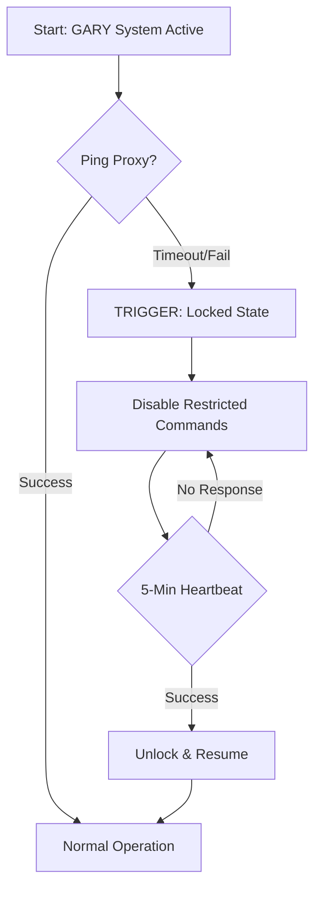

# Revary - Hybrid Distributed Bot Architecture

Version: **0.0.6**

Revary is a high-performance, asynchronous Discord system designed to demonstrate proficiency in concurrent process management, secure data persistence, and networked infrastructure. The project coordinates multiple service layers to provide custom advanced data archiving and automated utility services.

---

## Core Competencies Demonstrated

- Asynchronous Concurrency: Managed via asyncio.TaskGroup for simultaneous execution of several discord.py instances.

- Security & Cryptography: Implementation of Argon2 ID hashing with custom salts and MFA-backed command authorization for critical operations.

- DevOps & Infrastructure: Hybrid cloud deployment (via a Google Cloud VM) with Doppler for secret management and residential proxy tunneling. Docker is also used to contain the instance.

- Resiliency Patterns: Custom heartbeat/ping-loop logic to handle potential "zombie" states in the case of a module shutdown. 

- Database Management: Use of a PostgreSQL server to hold data needed for various operations, along with an implementation of a database schema. 

---

## System Architecture

The system is divided into three distinct modules/layers to adhere to the Principle of Least Privilege:

### The Interaction Layer (Revu)

- The primary interface for standard operations. Handles high-traffic commands including economy systems, server utilities, and general user engagement.

### The Middleware Relay (GARY)

- Acts as a security buffer and formatting engine. It manages complex data rendering (Embeds) and serves as the gatekeeper for sensitive operations, performing authorization checks before passing instructions to the integration layer.

### The Integration Layer (User-Context Engine)

- A specialized module designed for high-granularity data tasks that require specific user-level permissions (e.g., Group Chat archiving and metadata retrieval) that are not possible via the aforementioned interaction layer nor the middleware relay.

- Traffic Shaping: Uses dynamic temporal constraints based on HTTP headers to ensure compliance with rate-limiting thresholds while executing automated archival operations.

- Humanization Logic: Implements jittered execution intervals and location-aware routing (via a residential proxy) to simulate organic network behavior.

---

## Security & Persistence

- Authorization: Access is controlled via a PostgreSQL backend. User IDs are protected using Argon2 hashing.

- Secret Management: Zero-exposure of API keys/tokens through Doppler containerization.

- Fail-Safe Mechanism: A "locked state" is triggered automatically if the proxy heartbeat fails, preventing unauthenticated or orphaned requests.

---

## Commands & Features

While not all commands/features are finalized nor thought of, these are some of the basic commands that are planning to be used:

**Format:** /[group] [list of subcommands] | Comments

**Revu:**
- /action [hug, punch, touch, highfive, poke, kiss, fight, slap, waveridermode]
- /archive [channel, avatar]
- /backlog [list, add, remove, completed]
- /channel [message, image]
- /economy [wallet, balance, daily, withdraw, deposit, shop, purchase, sell, refund, auction, bid, leaderboard, profile]
- /cipher [encrypt, decrypt] | Custom substitution cipher for obfuscated localized communication
- /level [rank, leaderboard]
- /misc [test, ship]
- /profile [user]
- /reminder [set, list]
- /server [info, icon, banner, id]
- /td [list, add, complete] | td means "to-do"
- /user [avatar, banner, profile, id]
- /utils [sites, library, search, news, urban, gifs]

**GARY:**
- /ai [ask, list, session, personality]
- /archive [group, tiermaker]
- /logger [on, off]
- /proxy [status]

---

## Why this exists

This project serves as a technical portfolio for demonstrating software logistics awareness, alongside implementing critical networking concepts. It explores the boundaries of API interaction, managing state across distributed nodes, and securing unauthorized access points in a live environment.

---

## Compliance & Deployment Note

Proof of Concept: The Integration Layer (User-Context Engine) is designed strictly as a technical demonstration of traffic shaping, jittered execution, and residential proxy integration.

ToS Adherence: To remain compliant with Discord’s Terms of Service, the Integration Layer is disabled by default in production environments. This project serves as a "White-Box" architectural study in networked automation rather than a live utility for user-account automation.

Containerization: The entire ecosystem is orchestrated via Docker Compose. Each layer (Revu, GARY, and the Integration Engine) runs in an isolated container, ensuring that environment-specific dependencies (like proxy tunnels or crypto-libraries) do not bleed into the host system.
